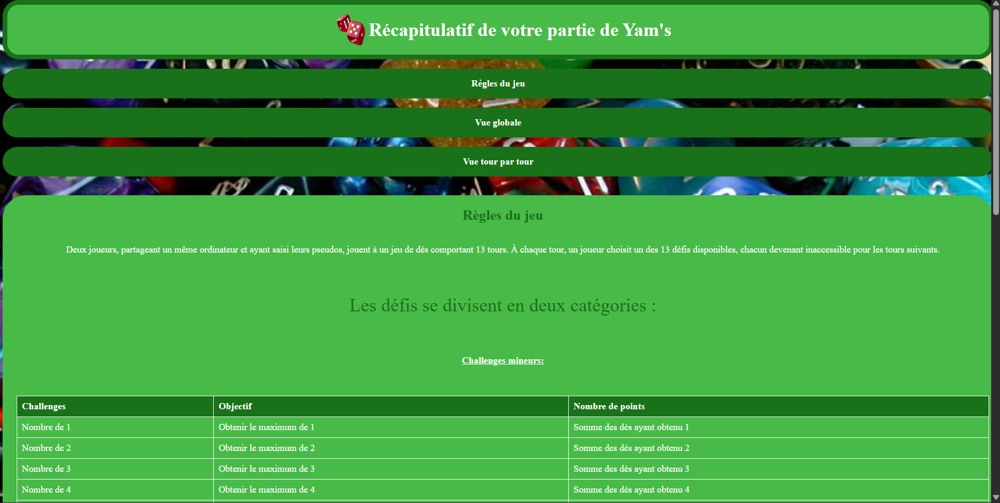
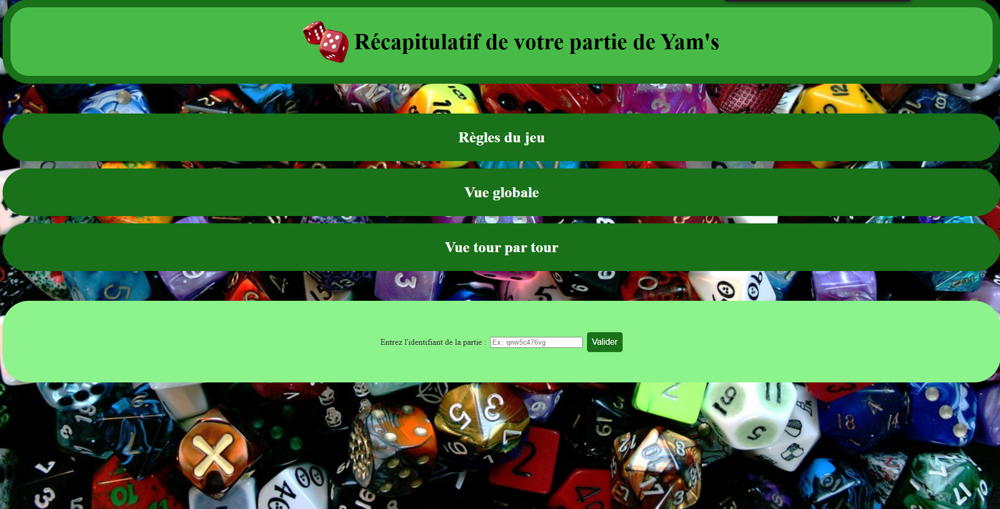
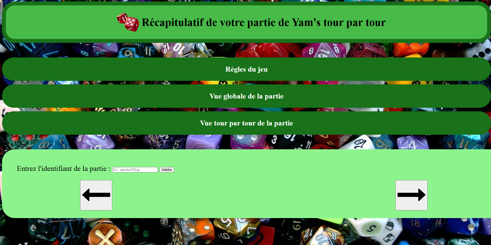

# Yam's 🎲

Ce projet est constitué de deux parties, **le code** qui permet de jouer au jeu de yam's et **le site web** qui permet d'afficher les résultats du fichier json remplis avec le code. 

Malheureusement le site pour fournir le code de partie est inaccessible car il était fourni par les professeurs donc il est impossible d'afficher les résultats sur le site web.


## Table des matières
- [Le code](#le-code)
  - [Technologies utilisées](#technologies-utilisées)
  - [Executer du code](#executer-le-code)
  - [Présentation](#présentation-du-site-web)
  - [Images](#images)
- [Le site web](#le-site-web)
  - [Technologies utilisées](#technologies-utilisées)
  - [Lancement du site web](#lancement-du-site-web)
  - [Présentation](#présentation-du-site-web)
  - [Utilisation](#utilisation)
  - [Images](#images)

# Le code

## Technologies utilisées

- **Langage** : C#
- **Framework** : Mono (Linux)
- **Stockage** : Fichier JSON

  
## Executer le code 
Sur **Linux**, compilez et exécutez le programme avec les commandes suivantes :

```bash
# Compilation du programme
mcs yams.cs

# Exécution du programme
mono yam.exe
```

## Présentation du code

Le programme est organisé pour gérer une partie de Yams entre deux joueurs. La fonction principale, Main, s'occupe de dérouler le jeu, comme gérer les tours des joueurs et afficher les scores finaux. Des fonctions comme PlayTurn gèrent ce qu'un joueur fait pendant son tour : lancer les dés, choisir une catégorie pour marquer des points, et calculer son score. Une autre fonctions comme CalculateScore, permet de vérifier combien de points un joueur gagne pour une catégorie donnée. Une partie du programme permet aussi d’enregistrer les détails de la partie dans un fichier JSON.

Le programme utilise des tableaux pour suivre les scores des joueurs. Par exemple, un tableau d'entiers garde les points obtenus dans chaque catégorie. Il y a aussi un tableau de booléens pour vérifier si une catégorie a déjà été utilisée par un joueur. Les informations d’une manche (résultats des lancers, catégorie choisie, score) sont stockées dans des listes de dictionnaires. Ces structures permettent de garder les données bien organisées tout au long de la partie.

On vérifie les défis (comme les suites ou les brelans) dans la fonction CalculateScore. Pour des combinaisons comme le brelan ou le carré, le programme compte combien de fois chaque valeur apparaît dans les dés. Un autre algorithme calcule si les scores des catégories mineures atteignent 63 points, ce qui ajoute un bonus. Ces algorithmes suivent les règles du Yams tout en étant clairs et efficaces.

## Images


# Le site web

## Technologies utilisées

- **HTML/CSS** : pages statiques avec Flexbox
- **JavaScript** : affichage dynamique des résultats
- **JSON** : source des données (non accessible actuellement)

## Lancement du site web
1. Clic droit sur regles_du_jeu.html
2. Ouvrir avec votre navigateur de prédilection

>Les autres pages nécessitent un identifiant de partie et un serveur actif pour fonctionner.
  
## Présentation du site web 

La page html regles_du_jeu.html est axée sur la présentation des règles du jeu elle est reliée à un fichier css stylereglesdujeu.css qui est organisée avec des flexbox. La page html contient donc le titre avec le logo, ensuite, le menu de navigation où on peut accéder aux autres pages qui affiche votre partie de yam’s. Enfin on a la partie principale de la page web, là où l’on peut lire les règles.

La deuxième page html vue_globale.html permet de voir toute la partie en entrant l’identifiant de votre partie de yam’s et en appuyant sur le bouton valider. La page est reliée à un fichier css styleglobal.css et au fichier javascript vueglobale.js. La page css est composée quasiment comme la page des règles du jeu, le logo et le titre avec le menu, il y a juste le contenu de la partie principale qui change. On a donc un formulaire où l’on peut rentrer un identifiant de partie de yam’s et si on appuie sur valider, grâce au fichier javascript relié, cela affiche toute la partie avec à la fin les résultats finaux. Le code css est réalisé uniquement en flexbox et répond donc bien à la consigne donnée.

La troisième page html vue_tour_par_tour.html permet de voir la partie tour par tour avec les résultats finaux écrit à la fin. La page est reliée au fichier css styletour.css et au fichier javascript tourpartour.js . Elle est composée comme les deux autres pages du logo et titre et du menu, la partie principale permet aussi de rentrer un identifiant de partie pour afficher les détails de la partie tour par tour. Elle permet de naviguer entre les tours avec les flèches gauche et droite, les résultats finaux sont écrits à la suite et pour chaque tour. Le code css n’est réalisé qu’avec des flexbox pour répondre à la consigne.

## Utilisation

Clic droit sur le fichier regles_du_jeu.html puis ouvrir avec et choisissez votre navigateur web.

## Images


<br>
<p>Fenêtre des règles du jeu</p>
<br><br><br>


<p>Fenêtre d'affichage des résultats global</p>
<br><br><br>


<p>Fenêtre d'affichage des résultats tour par tour</p>
<br><br><br>
